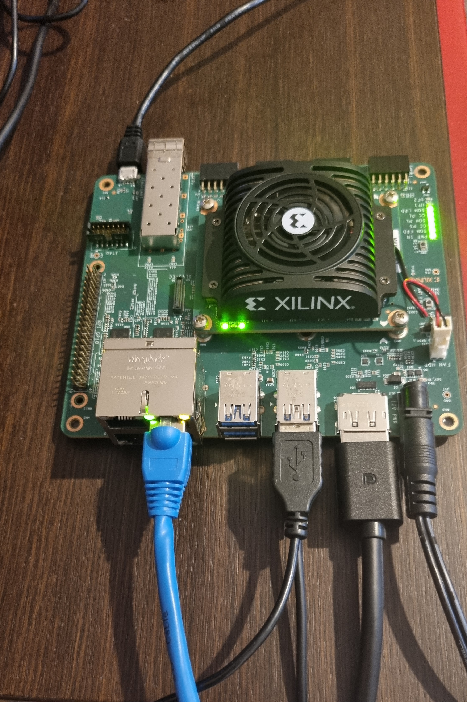
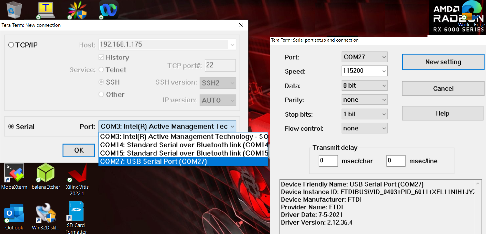
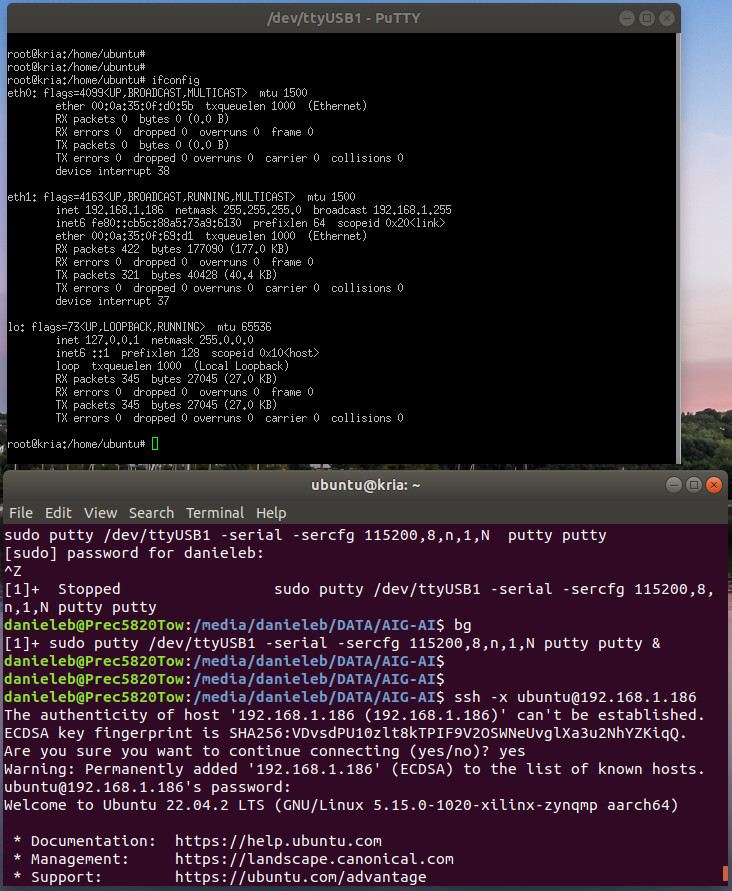
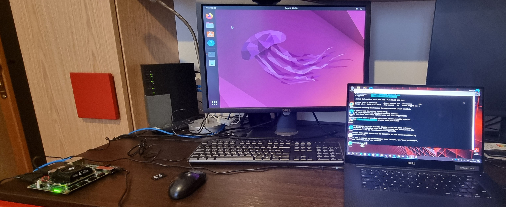
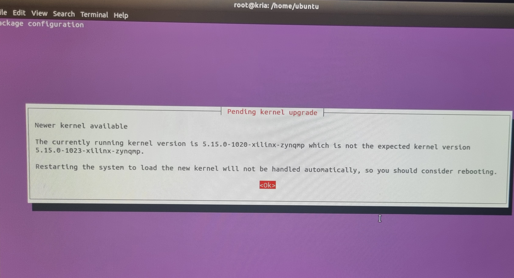
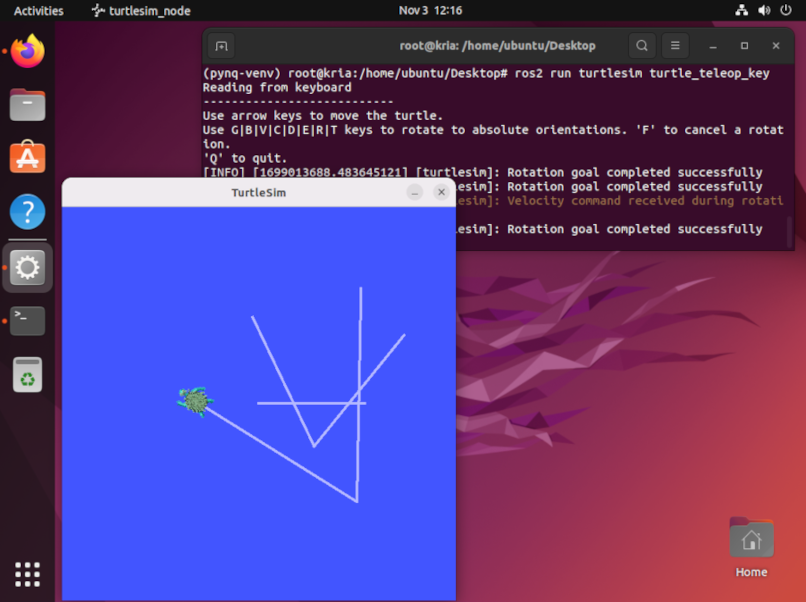
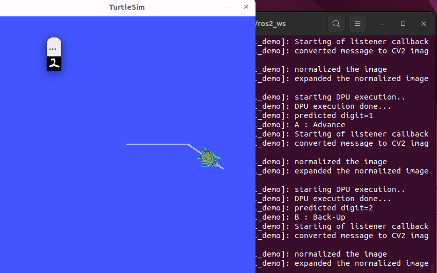
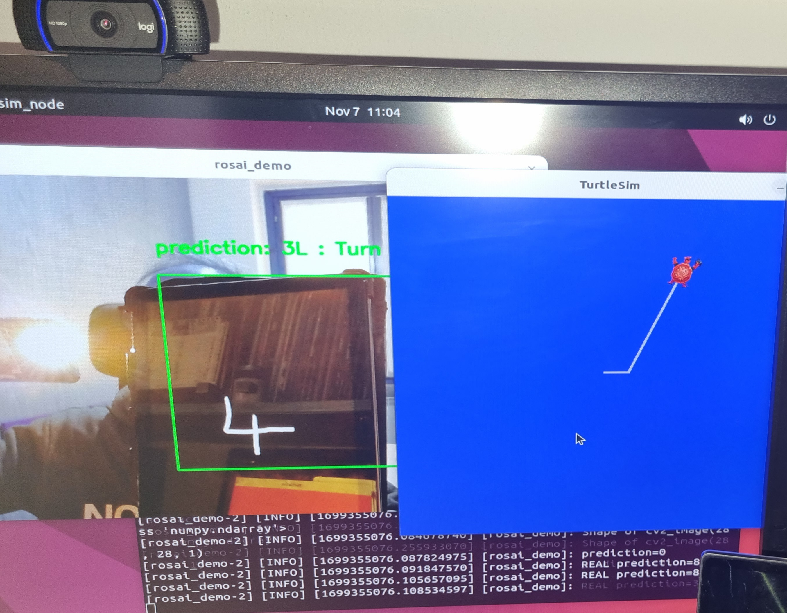

<!--
Copyright © 2023 Advanced Micro Devices, Inc. All rights reserved.
SPDX-License-Identifier: MIT

-->

<table class="sphinxhide" width="100%">
 <tr width="100%">
    <td align="center"><h1> AIG </h1>
    </td>
 </tr>
</table>

# KR260 Robotics AI Developer Challenge


### Current Status

- Authors:

  - Somayeh Rahimipour (srahimip, DAT)

  - Damoder Mogilipaka (damoderm, AIG-AI)

  - Dachang Li (dachang, AIG-AI)

  - Daniele Bagni (danieleb, SAIS)

- Target board: KR260

- Tools: Vitis 2023.1 & Vitis-AI 3.5 releases

- Last update:  05 Dec. 2023


## Table of Contents

[Robotics AI with KR260](#robotics-ai-with-kr260)  

[1 Introduction](#1-introduction)

[2 Getting Started with KR260](#2-getting-started-with-kr260)

[3 INSTALL PYNQ DPU](#3-install-pynq-dpu)

[4 Test PYNQ DPU with Python or C++ VART APIs](#4-test-pynq-dpu-with-python-or-c-vart-apis)

[5 INSTALL ROS2](#5-install-ros2)

[6 ROSAI Application](#6-rosai-application)

[Appendix](#appendix)

[Acknowledgements](#acknowledgements)

[License](#license)


## Robotics AI with KR260

#### Overview

The integration of AI techniques into robotics has gained immense traction sparking increased research, investment, and practical applications across different sectors. AI in robotics empowers robots to emulate human-like abilities through machine learning, computer vision, natural language processing and more. This integration holds immense potential for revolutionizing industries like manufacturing, healthcare, transportation, and more by enhancing robots' capabilities and adaptability.

The AMD Kria™ KR260 Robotics Starter Kit is a Kria SOM-based development platform for robotics and factory automation applications and enables roboticists and industrial developers without FPGA expertise to develop hardware accelerated applications for robotics, machine vision, and industrial communication and control. Developers benefit with greater flexibility from native ROS 2 and Ubuntu support.  The pre-built interfaces and accelerated applications make the KR260 an ideal platform to accelerate robotics AI innovation. 
 
#### This Repo:

The focus of this repo is for AI vision-guided robotics applications using camera inputs and control output with ROS and AI targeting the Kria™ KR260 SOM and PYNQ/Vitis-AI software platform.
 
#### Application Examples:

1. Human Assist AI enabled robotics
2. New experiences in mobility and human-machine interfacing
3. Highly optimized embedded AI model architectures (image, voice)

#### Requirements:

1. Use the [AMD Kria SOM KR260](https://www.xilinx.com/products/som/kria/kr260-robotics-starter-kit.html).
2. Use either [Vitis-AI](https://github.com/Xilinx/Vitis-AI) or [PYNQ](http://www.pynq.io/) software development stacks.


##  1 Introduction

This document explains how getting started with the Kria KR260 Robotics Starter Kit, which includes the following accessories inside the box:

- power supply and its adapters,
- Ethernet cable,
- USB A-male to micro B cable,
- a micro-SD card with adapter, possibly with size greater than 32GB (64GB is certainly a very good choice).

You will need the following accessories to utilize the KR260 desktop environment:

- USB Keyboard,
- USB Mouse,
- DisplayPort Cable (for connecting to a monitor),
- an HDTV (1920x1080 as minimum resolution) monitor with DisplayPort connector.

To begin, a computer with internet connection and with the ability to write to the micro-SD card is needed.


## 2 Getting Started with KR260

The Kria™ Robotics Starter Kit has a primary and secondary boot device, isolating the boot firmware from the runtime OS and application. This allows you to focus on developing and updating your application code within the application image on the secondary boot device, without having to touch the boot firmware. The primary boot device is a QSPI memory located on the SOM, which is pre-programmed (pre-loaded QSPI image) at the factory. The secondary boot device is a micro-SD card interface on the carrier card.

### 2.1  Setting up the Ubuntu SD Card Image

For setting up the micro-SD card, you’ll need to download the latest SD card image and then write it to the micro-SD card using an Image Flashing tool.

1. Go to the [Install Ubuntu on AMD](https://ubuntu.com/download/amd) website, in the ``Choose a board`` tag, select ``Kria K26 SOMs``, then click on``Download 22.04 LTS`` (green colored) button and save the ``iot-limerick-kria-classic-desktop-2204-x07-20230302-63.img.xz``
 archive on your computer.

2. Write the image file to the SD card with one of the methods described in [setting up the sd card image](https://www.xilinx.com/products/som/kria/kr260-robotics-starter-kit/kr260-getting-started/setting-up-the-sd-card-image.html) reference document, for example with the [Balena Etcher](https://etcher.balena.io) tool (recommended since it is available for Window, Linux, and macOS).

### 2.2 Connecting Everything

Figure 1 illustrates the key connections for the AMD Kria™ KR260 Robotics Starter Kit:

1. Insert the micro-SD card containing the boot image in the micro-SD card slot (J11) on the Starter Kit.

2. Get your USB-A to micro-B cable (a.k.a. micro-USB cable), which supports data transfer. Do not connect the USB-A end to your computer yet. Connect the micro-B end to J4 on the Starter Kit.

3. Connect your USB keyboard/mouse to the USB ports (U44 and U46).

4. Connect to a monitor/display with the help of a DisplayPort cable.

5. Connect the Ethernet cable to one of the PS ETH ports (the top right port: J10D) for required internet access with the factory loaded firmware.

6. Grab the Power Supply and connect it to the DC Jack (J12) on the Starter Kit. **Do not insert the other end to the AC plug yet.**

At this point, a supported USB camera/webcam can be connected to the Starter Kit.




*[Figure 1] Peripherals connected to boot the KR260 with Ubuntu 22.04 GNOME Desktop (only the webcam is missing).*


### 2.3 Booting your Starter Kit

Now you can turn on your board with the KR260 Ubuntu image.

The default login credentials are:
- username: ``ubuntu``
- password: ``ubuntu``

The standard system policy requires you to change the password after the first time you log in with the default credentials.

You can login using either the traditional way over the [UART serial port](#231-login-with-uart) or a [full GNOME Desktop](#232-login-with-gnome-desktop).


#### 2.3.1 Login with UART

1. If you want to connect a Windows PC with the target board with UART, you can use [TeraTerm](https://tera-term.en.lo4d.com/download), for example via ``COM27`` port (of course this will depend on your computer), as illustrated in Figure 2.

2. If you have a Linux host computer you can connect to the target board via ``PuTTY`` utility, you have to launch these commands (note that you have to select the second port - ttyUSB1 - among the four available ttyUSBX with X=0,1,2,3):

  ```bash
  # from your host PC
  # search for USB devices with "tty" string and
  # look at the second of the list (ttyUSB1)
  dmseg | grep tty

  # call PuTTY on ttyUSB1 for KR260
  sudo putty /dev/ttyUSB1 -serial -sercfg 115200,8,n,1,N
  ```

  Then open a shell directly on the board and check the board IP address:

  ```bash
  # be superuser
  sudo su

  # check network connections
  ifconfig
  ```

  You should get a constant IP address, for example with value ``192.168.1.186`` (reported as ``<ip_address>`` in the following of this document), which you can use to transfer files with ``scp`` between your host PC and target card or to open a remote shell with ``ssh -X ubuntu@<ip_address>`` from your host PC, as illustrated in Figure 3.

  

  *[Figure 2] UART serial connection with Teraterm running on a Windows 11 laptop PC (COM27 port, for this particular case) and the KR260.*

  

  *[Figure 3] Top: UART serial connection with ``PuTTY`` on a Linux desktop PC and the KR260. Bottom: connecting to the KR260 with ``ssh``.*


#### 2.3.2 Login with GNOME Desktop

To login into the GNOME Desktop, you must connect a DisplayPort monitor, as well as a USB Keyboard and Mouse to the board.

Power ON the Starter Kit by connecting the power supply to the AC plug. The power LEDs should illuminate, and after about 10-15 seconds, you should see console output on the connected display.  After about a minute, the desktop login screen should appear with its traditional Jellyfish image shown in Figure 4.

Note that the Starter Kit powers up immediately when you connect the AC plug to a wall. (There’s no ON/OFF switch on the board.)

If you see the heartbeat LED is active but there's no output on the monitor, check your monitor to ensure that it’s powered on and the correct input is selected.

Once logged in, you should see the default Ubuntu 22.04 LTS GNOME 3 desktop.
Open a terminal and set the date as today with the following command:

```bash
sudo date -s "YYYY-MM-DD HH:MM:SS"
```

Then verify internet connectivity with the command ``ping 8.8.8.8``.

If you can observe that packet transmit/receive worked and there is no packet loss with the above ping command, this means your internet connectivity is working and active.

Note that without internet connectivity, you will not be able to perform the ROS-AI application steps or install the necessary tools and packages.



*[Figure 4] KR260 booting done. Note the GNOME Desktop on the monitor directly connected to the KR260 and the serial connection with a Windows 11 laptop running Teraterm.*

## 3 Install PYNQ DPU

[PYNQ](http://www.pynq.io/) can be used for loading the Deep Learning Processor Unit (DPU) overlay with the CNN model of your choice for your AI inference applications.

To install PYNQ on your KR260 board you have to be superuser and run the script [install_update_kr260_to_vitisai35.sh](files/scripts/install_update_kr260_to_vitisai35.sh).

Login in on your KR260 board and clone this repository directly in the KR260 board, so that you should
have it available in the ``/home/ubuntu/KR260-Robotics-AI-Challenge`` folder.

The very first thing to do is checking with ``dos2unix`` utility all shell (``*.sh``) files, as they could have been moved from Windows-OS to Linux-OS
file systems and viceversa, thus loosing the Unix format. In order to do so, you have to run the following commands:

```bash
#install dos2unix utility
sudo apt install dos2unix
# go to the scripts folder
cd /home/ubuntu/KR260-Robotics-AI-Challenge/files/scripts
# check each shell file
for file in $(find . -name "*.sh"); do
    echo ${file}
    dos2unix ${file}
done
```

Now you can start the real installation by launching the following commands (**you must be superuser**):

```bash
sudo su
cd /home/ubuntu/KR260-Robotics-AI-Challenge
cp files/scripts/install_update_kr260_to_vitisai35.sh /home/ubuntu
cd /home/ubuntu
source ./install_update_kr260_to_vitisai35.sh
```

This script will install the required debian packages, create a Python virtual environment, named ``pynq_venv``, and configure a Jupyter portal. The process takes around 30 minutes. The script will also update the packages from Vitis-AI 2.5 (which officially supports KR260 at the moment this document is written) to the latest Vitis-AI 3.5 (not yet supporting KR260 at the moment this document is written), so you can deal with the latest material available in Vitis-AI 3.5 for what concerns Machine Learning.

You might incur in some of the following next three situations (all of them in the worst case):  

1. During the install process you might see a window popping up, with a warning about a ``*xilinx-zynqmp*`` kernel mismatch, in that case just  accept the ``maintainer's version`` and go on.

2. If the install procedure stops with an error, just run ``source ./install_update_kr260_to_vitisai35.sh`` again, the second trial should take less time.

3. If at the end of the process you see a window like the one illustrated in Figure 5, just click ``OK``.

  

  *[Figure 5] Message during the PYNQ DPU install and update process.*


Once finished successfully, you should see all the packages listed in the [Included Overlays](https://github.com/Xilinx/Kria-PYNQ#included-overlays) reference document already installed, including the [DPU-PYNQ](https://github.com/Xilinx/DPU-PYNQ) repository.

Now you have to reboot the board (being superuser yet):

```bash
reboot
```

**At this time, you are strongly recommended to check the environment you have just installed by running all the examples described in Section 4**.


### Things to Remember

In the following of this document, before running any application, you have to become superuser and set the proper python3 virtual environment (see item 3 in the [References](#References) section for more information) with these commands:

```bash
# you must always start as super user
sudo su

# set the pynq environment
source /etc/profile.d/pynq_venv.sh
```

To exit from the virtual environment, type the command:

```bash
deactivate
```


## 4 Test PYNQ DPU with Python or C++ VART APIs

The best way to test your freshly installed environment, is by running an application.

You have three choices to run ML inference applications on the PYNQ DPU of KR260:

1. by opening a Jupyter Notebook (``.ipynb`` file extension), or

2. by running a plain Python script (``.py`` file extension), or

3. by compiling C++ modules and then launching the produced executable.

In all cases, you are using the Vitis-AI Runtime ([VART](https://docs.xilinx.com/r/en-US/ug1414-vitis-ai/Programming-with-VART)) APIs, which are available both in Python (first two items) and C++ language (third item).

If you see the following message, just ignore it:

```text
WARNING: Logging before InitGoogleLogging() is written to STDERR
F20231109 13:28:07.871371  8865 xrt_device_handle_imp.cpp:327] Check failed: r == 0 cannot set read range! cu_index 0 cu_base_addr 2147549184 fingerprint 0x101000056010407 : Invalid argument [22]
```


### 4.1 Use Jupyter Notebook

After setting the ``pynq_venv`` environment, you can go to your jupyter notebook home folder and fetch the latest notebooks:

```bash
cd $PYNQ_JUPYTER_NOTEBOOKS
# do the following command only once
pynq get-notebooks pynq-dpu -p .
```

Assuming the IP address of your card is ``192.168.1.186`` (you can easily know it by running on a terminal the command ``ifconfig -a``),  you can connect to ``JupyterLab`` via a web browser using this URL: ``192.168.1.186:9090/lab`` or ``kria:9090/lab`` (account ``xilinx`` with password ``xilinx``), then you can launch a notebook application, among the ones listed here:

```text
pynq-venv) root@kria:/home/root/jupyter_notebooks# ls -l pynq-dpu/

total 95524
-rw-r--r-- 1 root root    37598 Nov  9 16:28 dpu_mnist_classifier.ipynb
-rw-r--r-- 1 root root   801364 Nov  9 16:19 dpu_mnist_classifier.xmodel
-rw-r--r-- 1 root root   199985 Nov  9 16:19 dpu_resnet50.ipynb
-rw-r--r-- 1 root root   655582 Nov  9 16:19 dpu_resnet50_pybind11.ipynb
-rw-r--r-- 1 root root 26657004 Nov  9 16:19 dpu_resnet50.xmodel
-rw-r--r-- 1 root root   137825 Nov  9 16:19 dpu_tf_inceptionv1.ipynb
-rw-r--r-- 1 root root  5921078 Nov  9 16:19 dpu_tf_inceptionv1.xmodel
-rw-r--r-- 1 root root   169209 Nov  9 16:19 dpu_yolov3.ipynb
drwxr-xr-x 2 root root     4096 Nov  9 16:19 img
-rw-r--r-- 1 root root 63212947 Nov  9 16:19 tf_yolov3_voc.xmodel

(pynq-venv) root@kria:/home/root/jupyter_notebooks# ls -l getting_started/

total 900
-rw-rw-rw- 1 root root  30068 Nov  9 15:05 1_jupyter_notebooks.ipynb
-rw-rw-rw- 1 root root  17569 Nov  9 15:05 2_python_environment.ipynb
-rw-rw-rw- 1 root root 863661 Nov  9 15:05 3_jupyter_notebooks_advanced_features.ipynb
drwxrwxrwx 2 root root   4096 Nov  9 15:05 images

(pynq-venv) root@kria:/home/root/jupyter_notebooks# ls -l pynq-helloworld/

total 9272
drwxrwxrwx 2 root root    4096 Nov  9 16:00 images
-rw-rw-rw- 1 root root 7797813 Nov  9 15:07 resizer.bit
-rw-rw-rw- 1 root root  395399 Nov  9 15:07 resizer.hwh
-rw-rw-rw- 1 root root  649101 Nov  9 15:07 resizer_pl.ipynb
-rw-rw-rw- 1 root root  639777 Nov  9 15:07 resizer_ps.ipynb

(pynq-venv) root@kria:/home/root/jupyter_notebooks# ls -l kv260

drwxrwxrwx root/root         0 2023-11-09 11:00 ./kv260/microblaze/
-rw-rw-rw- root/root      6390 2023-11-09 10:55 ./kv260/microblaze/microblaze_c_libraries.ipynb
-rw-rw-rw- root/root      7054 2023-11-09 10:55 ./kv260/microblaze/microblaze_python_libraries.ipynb
-rw-rw-rw- root/root     13143 2023-11-09 10:55 ./kv260/microblaze/microblaze_programming.ipynb
-rw-rw-rw- root/root    141256 2023-11-09 11:47 ./kv260/video/opencv_filters_webcam.ipynb
-rw-rw-rw- root/root    148997 2023-11-09 10:55 ./kv260/video/data/opencv_filters.jpg
-rw-rw-rw- root/root    284700 2023-11-09 10:55 ./kv260/video/data/sobel.jpg
-rw-rw-rw- root/root    170226 2023-11-09 10:55 ./kv260/video/data/orig.jpg
-rw-rw-rw- root/root    341406 2023-11-09 10:55 ./kv260/video/data/haarcascade_eye.xml
-rw-rw-rw- root/root    930127 2023-11-09 10:55 ./kv260/video/data/haarcascade_frontalface_default.xml
-rw-rw-rw- root/root    146789 2023-11-09 10:55 ./kv260/video/data/gray.jpg
-rw-rw-rw- root/root      4443 2023-11-09 10:55 ./kv260/video/mipi_to_displayport.ipynb
-rw-rw-rw- root/root      4060 2023-11-09 10:55 ./kv260/video/display_port_introduction.ipynb
-rw-rw-rw- root/root    284545 2023-11-09 10:55 ./kv260/video/opencv_face_detect_webcam.ipynb
```

Note that you can see the folder ``/home/root/jupyter_notebooks/kv260`` only if you enabled the line ``bash install.sh -b KV260`` during step 2 of the
[install_update_kr260_to_vitisai35.sh](files/scripts/install_update_kr260_to_vitisai35.sh) script.


### 4.2 Use Plain Python Code

In this section, you will see an example with ResNet18 CNN designed with the [VART APIs](https://docs.xilinx.com/r/en-US/ug1414-vitis-ai/Programming-with-VART) in Python.

This ResNet18 application is taken from the [Running ResNet18 CNN Through Vitis-AI 3.5 Flow for ML](https://github.com/Xilinx/Vitis-AI-Tutorials/tree/3.5/Tutorials/RESNET18/#running-resnet18-cnn-through-vitis-ai-35-flow-for-ml) tutorial, in which a ResNet18 CNN pre-trained with the [ImageNet](http://www.image-net.org/) dataset (1000 classes, RGB images of 224x224 size), was modified and fine-tuned for the [CIFAR10](https://www.cs.toronto.edu/~kriz/cifar.html) dataset (10 classes, RGB images of 32x32 size).

In the [cifar10_tf2](files/cifar10_tf2) folder, you can use the [app_cifar10_tf2_resnet18.py](files/cifar10_tf2/app_cifar10_tf2_resnet18.py) application code to run inference with the modified ResNet18 on some CIFAR10 test images. The quantized model is named ``quantized/q_resnet18_cifar10.h5`` and it was generated by running the original tutorial with Vitis-AI 3.5 release. Now, you have to compile the quantized model for the current KR260 board using the Vitis-AI compiler. Here are the various steps if you want to re-do it from scratch, otherwise you can use the already available model named ``compiled/kr260_cifar10_tf2_resnet18.xmodel`` and skip step 2, jumping directly from step 1 to to step 3:

1. From your host computer enter the Vitis-AI 3.5 CPU docker image and enter in the TF2 virtual environment:

  ```bash
  # from your host computer launch the docker CPU 3.5 image
  ./prepare_docker.sh
  ./docker_run.sh xilinx/vitis-ai-tensorflow2-cpu:latest

  # now you are inside docker CPU 3.5
  conda activate vitis-ai-tensorflow2
  ```

2. Go to the ``cifar10_tf2`` folder and launch the [vitisai_compile.sh](files/cifar10_tf2/vitisai_compile.sh) script:

  ```bash
  # compile the CNN quantized models
  bash -x ./vitisai_compile.sh  kr260  ./quantized/q_resnet18_cifar10.h5     ./compiled   kr260_cifar10_tf2_resnet18
  ```

3. Prepare the test images to be used during the runtime application with the [cifar10_generate_images.py](files/cifar10_tf2/cifar10_generate_images.py) script:

  ```bash
  # you are supposed to be in cifar10_tf2 folder
  # prepare the test images
  bash -x ./prepare_cifar10.sh

  # you can exit from the docker image
  exit
  ```

4. Copy with ``scp -r`` the entire ``cifar10_tf2`` folder directly to your KR260 board at ``/home/ubuntu/KR260-Robotics-AI-Challenge/files/`` and then copy it also to
``/home/root/jupyter_notebooks/pynq-dpu/``. Login to the board and run the  
[app_cifar10_tf2_resnet18.py](files/cifar10_tf2/app_cifar10_tf2_resnet18.py) application file.  Here is the list of commands you should use:

  ```bash
  # 1) turn on the target KR260, which is assumed to have IP 192.168.1.186

  # 2) from your host PC copy the archive to the target board
  scp -r cifar10_tf2 ubuntu@192.168.1.186:/home/ubuntu/KR260-Robotics-AI-Challenge/files/

  # 3) now remotely connect to target KR260 from your host PC
  ssh -X ubuntu@192.168.1.186

  # 4) you are on the target board now

  # 5) become super user and set the virtual env
  sudo su
  source /etc/profile.d/pynq_venv.sh

  # 6) move the archive to its destination folder
  cd $PYNQ_JUPYTER_NOTEBOOKS
  cd pynq-dpu/
  mv /home/ubuntu/cifar10_tf2 .

  # 7) run the Python application
  cd cifar10_tf2
  python3 app_cifar10_tf2_resnet18.py
  cd ../
  ```

  You should see the following output text:

  ```text
  (pynq-venv) root@kria:/home/root/jupyter_notebooks/pynq-dpu/cifar10_tf2# python3 ./app_cifar10_tf2_resnet18.py

  ResNet18 CNN (pre-trained with ImageNet Dataset) fine-tuned to CIFAR10 Dataset, in TensorFlow2

  shapeIn   : (1, 32, 32, 3)
  shapeOut  : (1, 1, 1, 10)
  outputSize: 10

  Classifying 5000 CIFAR10 pictures ...
    Execution time: 15.0585s
        Throughput: 332.0380FPS

  Overall accuracy: 0.8502
  number of top1 false predictions  749
  number of top1 right predictions  4251
  top1 accuracy = 0.8502

  (pynq-venv) root@kria:/home/root/jupyter_notebooks/pynq-dpu/cifar10_tf2#
  ```

The prediction results are well aligned with the results obtained on the ZCU102 board with the [Running ResNet18 CNN Through Vitis-AI 3.5 Flow for ML](https://github.com/Xilinx/Vitis-AI-Tutorials/tree/3.5/Tutorials/RESNET18/#running-resnet18-cnn-through-vitis-ai-35-flow-for-ml) original tutorial.
The results in terms of throughput are related to a single-thread application, as this code does not apply multi-threading (which would certainly increase the performance).


### 4.3 Use VART C++ APIs

In the previous sections, all of the inference runtime applications were designed with the [VART APIs](https://docs.xilinx.com/r/en-US/ug1414-vitis-ai/Programming-with-VART) in Python.

In this section, you will design the inference application by using the C++ version of VART APIs. Then, you will test the prediction accuracy of the ResNet18 CNN model (``q_resnet18_cifar10.h5``) that was fine-tuned for the [CIFAR10](https://www.cs.toronto.edu/~kriz/cifar.html) dataset in the previous section (``kr260_cifar10_tf2_resnet18.xmodel``).

The [main_int8.cc](files/cifar10_tf2/code/src/main_int8.cc) is an example of an
inference application written in the C++ language. You can compile it directly on the board with [build_app.sh](files/cifar10_tf2/code/build_app.sh) shell script  
and launch it via the Python script [app_run_cifar10_cpp_code.py](files/cifar10_tf2/app_run_cifar10_cpp_code.py). You will see the filename of the input images and the predictions inferred by the CNN. You can then launch the Python script  
[check_runtime_top5_cifar10.py](files/cifar10_tf2/code/src/check_runtime_top5_cifar10.py) to check the average prediction accuracy.

Assuming you had already copied the ``cifar10_tf2`` folder and set the python3 environment as explained in the previous sections, and expanded the test images archive, here are the commands to launch on the KR260 board:

```bash
# you should already have done all the next four commands from previous section
sudo su
source /etc/profile.d/pynq_venv.sh
cd $PYNQ_JUPYTER_NOTEBOOKS
cd pynq-dpu/cifar10_tf2

# compile the C++ application directly on the board
cd code
bash ./build_app.sh
# rename it
mv code run_cnn.exe
cd ..

# run the C++ compiled exe
python3 ./app_run_cifar10_cpp_code.py 1> /dev/null

# check prediction accuracy
python3 ./code/src/check_runtime_top5_cifar10.py -i ./cpp_cifar10_predictions.log
```

You should see the following output text:

```text
(pynq-venv) root@kria:/home/root/jupyter_notebooks/pynq-dpu/cifar10_tf2# python3 ./app_run_cifar10_cpp_code.py

Launching Inference on MNIST with C++ Compiled Executable using C++ VART APIs
OUT  size 10
IN   size 3072
IN Height 32
IN Width  32
batchSize 1
. . .
Image : dog_7149.png
top[0] prob = 0.999936  name = dog
top[1] prob = 0.000058  name = cat
top[2] prob = 0.000004  name = deer
top[3] prob = 0.000002  name = frog
top[4] prob = 0.000000  name = bird
. . .
Image : truck_485.png
top[0] prob = 0.649907  name = ship
top[1] prob = 0.306994  name = truck
top[2] prob = 0.041547  name = airplane
top[3] prob = 0.001255  name = bird
top[4] prob = 0.000218  name = dog
successfull run. Exited with  0

(pynq-venv) root@kria:/home/root/jupyter_notebooks/pynq-dpu/cifar10_tf2# python3 ./code/src/check_runtime_top5_cifar10.py -i cpp_cifar10_predictions.log

cpp_cifar10_predictions.log  has  35005  lines
number of total images predicted  4999
number of top1 false predictions  752
number of top1 right predictions  4247
number of top5 false predictions  42
number of top5 right predictions  4957
top1 accuracy = 0.85
top5 accuracy = 0.99

(pynq-venv) root@kria:/home/root/jupyter_notebooks/pynq-dpu/cifar10_tf2#
```


## 5 Install ROS2

The [Robot Operating System](https://www.ros.org/) (ROS) is a set of software libraries and tools for building robot applications.

You will now install [ROS 2 Humble Hawksbill](https://docs.ros.org/en/humble/Installation.html) distribution on your Ubuntu 22.04 desktop of the KR260 target board.

First of all, boot the board and open a terminal and enter in the ``pynq_env`` as usual:

```bash
sudo su
source /etc/profile.d/pynq_venv.sh
```

Now you have to launch the [install_ros.sh](files/scripts/install_ros.sh) script from this repository to install ROS2:

```bash
cd /home/ubuntu/
cd KR260-Robotics-AI-Challenge/files/scripts/
source ./install_ros.sh
```

Also this process is quite long and you have to answers ``Y`` when prompted some times.


### Test TurtleSim

Once you've installed ROS2, you can verify it by starting ``TurtleSim`` by entering the following commands in your terminal:


```bash
# set up your ROS2 environment
source /opt/ros/humble/setup.bash
# launch the turtle simulator
ros2 run turtlesim turtlesim_node
```

As illustrated in Figure 6, the simulator window should appear, with a random turtle in the center. You can ignore text messages like this:

```
libGL error: failed to load driver: xlnx
```

Open another terminal and set up your ROS2 environment again. Now you will run a new node to control the turtle in the first node:

```bash
ros2 run turtlesim turtle_teleop_key
```




*[Figure 6] ROS2 simulator of ``turtlesim``.*


## 6 ROSAI Application

In your project directory, you can see a folder labeled [ROSAI](files/ROSAI), which contains a ROS2 design for controlling a robot, in this case, the turtle simulator, with an AI-based handwritten digit recognition model.

This application runs on the KR260 board and the same environment used in [test turtlesim section](#test-turtlesim), it was originally developed by [Avnet](https://www.avnet.com) for the [TECH BRIEFS Webinar Series: How to Control Robots with Gestures](https://event.webcasts.com/viewer/portal.jsp?ei=1608698&tp_key=6ac03a84b1) and here adapted properly for the KR260 board with PYNQ.

There are two folders:

1. [file_input](files/ROSAI/file_input), where the input images come from files.

2. [camera_input](files/ROSAI/camera_input), where the input images come from a camera.


### 6.1 File Input

Here are the steps to build and run the demo, which takes the input images from the files of the MNIST test dataset.

1. As usual, you have to become superuser and set the ``pynq_venv`` environment:

  ```bash
  sudo su
  source /etc/profile.d/pynq_venv.sh
  ```

3. Launch the [install_rosai_file_input.sh](files/scripts/install_rosai_file_input.sh) script to install and build this application. This script also save MNIST images for testing the application (see [save_images_from_MNIST_dataset.py](files/ROSAI/save_images_from_MNIST_dataset.py) file) and creates a workspace (shortly "ws") folder named ``ros2_ws_fileio``. You can get more details by looking at the comments inside the script itself.

  ```bash
  cd /home/ubuntu/KR260-Robotics-AI-Challenge/files/scripts
  source ./install_rosai_file_input.sh
  ```

6. Set the environment and execute the demo:

  ```bash
  # set env
  source /opt/ros/humble/setup.bash
  source install/local_setup.sh
  # go to the source code
  cd /home/root/ros2_ws_fileio
  # demo run
  ros2 launch rosai_file rosai_file_demo_launch.py
  ```

  Look at item 7 of [References](#references) if you get a warning message like ``unable to import Axes3D``.

  The ``TurtleSim`` window will pop up and after some seconds the turtle will move (forward, backward, left and right) based on the command, which is a digit recognized by the MNIST CNN classifier, as illustrated in Figure 7.


7. If you wish, you can remove the just build demo with the command:

  ```
  rm -rf build/ install/ log/
  ```



*[Figure 7] Screenshot of ROSAI file input demo: on the top left there is the input MNIST image, while the turtle moves accordingly.*


### 6.2 Camera Input


Here are the steps to build and run the demo that uses images from a camera as the input source. This demo was verified with a [Logitech HD Pro WebCam C920](https://www.logitech.com/it-it/products/webcams/c920-pro-hd-webcam.960-001055.html) camera.

First follow what reported in the Appendix [Check Your USB WebCam](#a3-check-your-usb-webcam). Then apply the following steps:

1. As usual you have to become super user and set the ``pynq_venv`` environment:

    ```bash
    sudo su
    source /etc/profile.d/pynq_venv.sh
    ```

2. Launch the [install_rosai_camera_input.sh](files/scripts/install_rosai_camera_input.sh) script to install and build this application. This script creates a workspace folder named ``ros2_ws``. A user can see the commands and related comments inside the script file.

  ```bash
  cd /home/ubuntu/KR260-Robotics-AI-Challenge/files/scripts
  source ./install_rosai_camera_input.sh
  ```


6. The following commands will launch the demo. Because of the way the model was trained, you need to use the images like the ones provided in the folder ``rosai_camera_input/black_background_images``, or you can create your own images. We recommend either printing the images on paper (one image per page) or using a display device to hold up in front of the camera.
Here are the commands:

    ```bash
    # set the environment
    source /opt/ros/humble/setup.bash
    source install/local_setup.sh
    # go to the source code
    cd /home/root/ros2_ws
    # demo the camera run
    ros2 launch rosai_camera rosai_camera_demo_launch.py
    ```

    Now, the ``TurtleSim`` gets launched, and the turtle will move based on the digit identified by the model, which is using a CNN classifier, as illustrated in Figure 8.

    The numbers corresponding to the movement direction are as follows:

    * 1=Forward
    * 2=Backward
    * 3=Left
    * 4=Right


7. If you wish, you can remove the just build demo with the command:

      ```
      rm -rf build/ install/ log/
      ```




*[Figure 8] Screenshot of ROSAI camera demo: the input digit ("4" in this case) is shown in input to the camera (green square) and the tutle moves accordingly*


## Appendix

### A1 Build ML Custom Models for KR260 PYNQ DPU

If you wish to run your own custom CNN model on the KR260, you have to train it and then quantize via the Vitis-AI release, and therefore you need the associated docker image.

Here is the processing flow you should do, working with [Vitis-AI](https://github.com/Xilinx/Vitis-AI):

1. Clone the [Vitis-AI 3.5](https://github.com/Xilinx/Vitis-AI/tree/2.5) repository and build its docker image (note that the master version contains **always** the latest release, which is 3.5,  at the moment this document is written).

2. Go to the [Vitis-AI 2.5 Model Zoo]((https://github.com/Xilinx/Vitis-AI/tree/2.5/model_zoo) and select some CNN model you might want to test (all those CNN models were pre-trained by AMD/Xilinx). Alternatively you can use your own custom CNN model (assuming you have already trained CNN it).

3. Quantize to fixed point and compile the CNN for the KR260 target board (note that the Model Zoo contains also the quantized model of every CNN, so you can skip this part if you like).

4. Write the ML application to make inference (or predictions) either in Python or in C++ using the DPU [Vitis-AI RunTime (VART)](https://xilinx.github.io/Vitis-AI/3.5/html/docs/workflow-model-deployment.html#vitis-ai-runtime) APIs to control the DPU itself via the ARM Host CPU.


### A2  Get Vitis-AI 3.5 Docker

Go to the [Vitis-AI 3.5 release](https://github.com/Xilinx/Vitis-AI) and zip the repository to get its ``zip`` archive; alternatively, you can clone it directly:

```bash
git clone https://github.com/Xilinx/Vitis-AI.git
```

Now you can build directly the docker image based on CPU with TensorFlow2 with these commands:

```bash
cd Vitis-AI/docker
./docker_build.sh -t cpu -f tf2
```

Alternatively to that, you can pull it directly from the [AMD Xilinx Docker Hub](https://hub.docker.com/u/xilinx), with the  command

```bash
docker pull xilinx/vitis-ai-tensorflow2-cpu
```

You have to use this CPU-based docker image to quantize and compile your CNN, in order to avoid any mismatch between the HW architecture (the DPU on your target board) and the  SW application (the VART APIs associated with the Vitis-AI release you are using).


But if you need to re-train from scratch your CNN, it is better you do it with the GPU-based docker image of Vitis-AI 3.5, from where you can generate the floating point model in [HDF5](https://www.hdfgroup.org/solutions/hdf5/) format (typically a file with extension ``.h5``).


### A3  Check Your USB WebCam

Connect a ``Logitech HD Pro Webcam C920`` camera to the USB port 'U44' of KR260 and run one of the following commands:

```bash
lsusb

v4l2-ctl --list-devices

ls /dev/vid*
```

and the related output text should be:

```text
ubuntu@kria:~$ v4l2-ctl --list-devices
HD Pro Webcam C920 (usb-xhci-hcd.1.auto-1.2):
	/dev/video0
	/dev/video1
	/dev/media0

ubuntu@kria:~$ ls  /dev/vid*
/dev/video0  /dev/video1
```

Then you can use the following Python code to capture and show some frames:

```python
import cv2
import numpy as np
cap = cv2.VideoCapture("/dev/video0") # check this
while(True):
    # Capture frame-by-frame
    ret, frame = cap.read()
    # Our operations on the frame come here
    gray = cv2.cvtColor(frame, cv2.COLOR_BGR2GRAY)
    # Display the resulting frame
    cv2.imshow("frame",gray)
    if cv2.waitKey(1) & 0xFF == ord("q"):
        break
# When everything done, release the capture
cap.release()
```


## References

1. [xlnx-config snap page](https://xilinx-wiki.atlassian.net/wiki/spaces/A/pages/2057043969/Snaps+-+xlnx-config+Snap+for+Certified+Ubuntu+on+Xilinx+Devices)

2. [Getting Started with Certified Ubuntu 20.04 LTS for Xilinx](https://xilinx-wiki.atlassian.net/wiki/spaces/A/pages/2037317633/Getting+Started+with+Certified+Ubuntu+20.04+LTS+for+Xilinx+Devices)

3. [virtualenv and venv Python Virtual Environments Explained](https://www.infoworld.com/article/3239675/virtualenv-and-venv-python-virtual-environments-explained.html#:~:text=If%20you%20want%20to%20verify,m%20pip%20install%20%2DU%20pip%20.)

4. [Build ML models for DPU-PYNQ](https://github.com/Xilinx/DPU-PYNQ/blob/master/host/README.md)

5. [TECH BRIEFS Webinar Series: How to Control Robots with Gestures](https://event.webcasts.com/viewer/portal.jsp?ei=1608698&tp_key=6ac03a84b1)

6. [Introducing TurtleSim](https://docs.ros.org/en/humble/Tutorials/Beginner-CLI-Tools/Introducing-Turtlesim/Introducing-Turtlesim.html)

7. [Import Axes3D  Issues](https://stackoverflow.com/questions/47550633/import-axes3d-issues)


## Acknowledgements

Here is the list of colleagues we would like to thank for the (very much appreciated) support received during the development of this project.

- Victoria Godsoe

- Sarunas Kalade

- Jens Stapelfeldt

- Prithvi Mattur

- Graham Schelle


<div style="page-break-after: always;"></div>


## License

The MIT License (MIT)

Copyright © 2023 Advanced Micro Devices, Inc. All rights reserved.

Permission is hereby granted, free of charge, to any person obtaining a copy
of this software and associated documentation files (the "Software"), to deal
in the Software without restriction, including without limitation the rights
to use, copy, modify, merge, publish, distribute, sublicense, and/or sell
copies of the Software, and to permit persons to whom the Software is
furnished to do so, subject to the following conditions:

The above copyright notice and this permission notice shall be included in all
copies or substantial portions of the Software.

THE SOFTWARE IS PROVIDED "AS IS", WITHOUT WARRANTY OF ANY KIND, EXPRESS OR
IMPLIED, INCLUDING BUT NOT LIMITED TO THE WARRANTIES OF MERCHANTABILITY,
FITNESS FOR A PARTICULAR PURPOSE AND NONINFRINGEMENT. IN NO EVENT SHALL THE
AUTHORS OR COPYRIGHT HOLDERS BE LIABLE FOR ANY CLAIM, DAMAGES OR OTHER
LIABILITY, WHETHER IN AN ACTION OF CONTRACT, TORT OR OTHERWISE, ARISING FROM,
OUT OF OR IN CONNECTION WITH THE SOFTWARE OR THE USE OR OTHER DEALINGS IN THE
SOFTWARE.


<p align="center"><sup>XD106 | © Copyright 2022 Xilinx, Inc.</sup></p>
